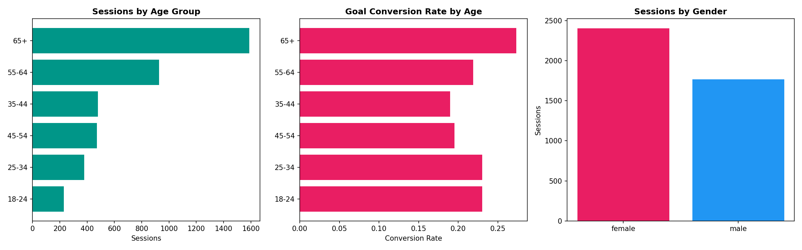
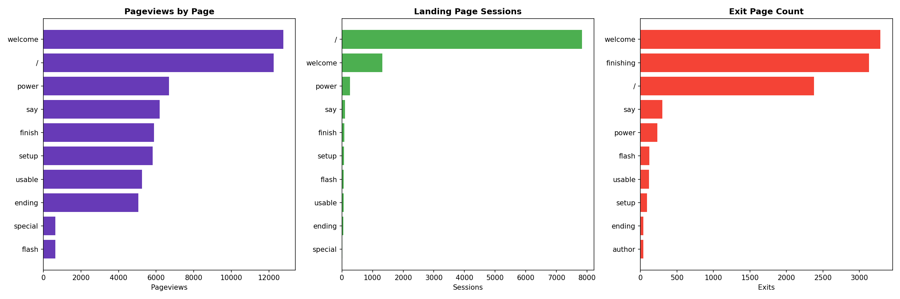
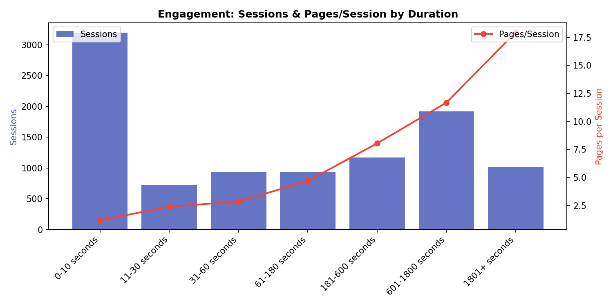
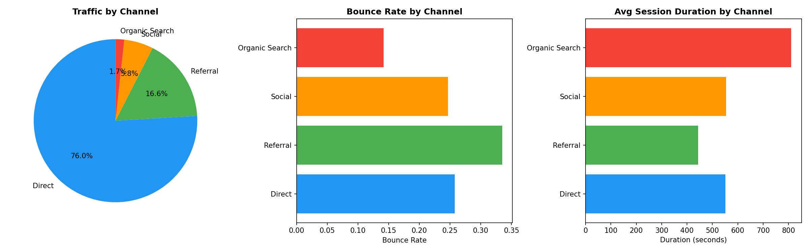
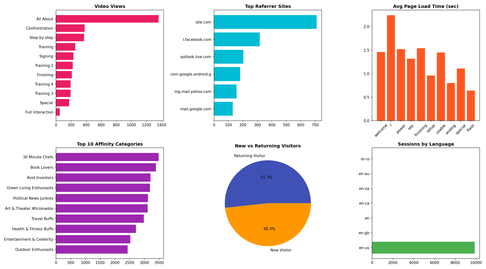

# Analytics Dataset Analysis Report

**Dataset:** Google Analytics data for a web site  
**Date Range:** June 1, 2017 – October 11, 2017  
**Total Sessions:** 9,888 | **Total Pageviews:** 62,488 | **Unique Users:** 4,771

---

## Data Review Methodology

The following methods were used to review the analytics dataset across its 19 sheets:

1. **Trend Analysis** — Time-series analysis of daily sessions to identify traffic patterns, peaks, and decay over the reporting period.
2. **Statistical Measures** — Calculated means, medians, standard deviations, percentiles, and distributions for sessions per user, session duration, bounce rate, and goal conversion rate across 4,771 individual users.
3. **Segmentation Analysis** — Compared metrics across audience segments: age, gender, browser, device, acquisition channel, and affinity category.
4. **Funnel Analysis** — Traced the page-view pathway from homepage → welcome → power → say → finish to understand user flow and drop-off.
5. **Visual Representations** — Created 9 chart sets including time series, bar charts, pie charts, histograms, and dual-axis comparison charts (see `analysis_output/` folder).

---

## Key Statistical Summary

| Metric | Value |
|--------|-------|
| Total unique users | 4,771 |
| Avg. sessions per user | 2.07 (median: 2) |
| Avg. session duration | 633s / ~10.5 min (median: 340s / ~5.7 min) |
| Users with 100% bounce rate | 708 (14.8%) |
| Users with any goal conversion | 2,040 (42.8%) |
| Mean goal conversion rate | 27.5% (among all users) |
| Top traffic channel | Direct (76.0% of all sessions) |
| Largest age group | 65+ (1,587 sessions — 39% of known-age traffic) |
| Gender split | 57.6% female / 42.4% male |
| Dominant language | en-us (99.7%) |

---

## Finding 1: The Site Serves an Older, Highly Engaged Audience — Design for Accessibility, Not Just Aesthetics

### The Data

The 65+ age group dominates this site's traffic with **1,587 sessions** — nearly as much as the 55-64 (928), 35-44 (479), 45-54 (471), 25-34 (378), and 18-24 (230) groups *combined*. Moreover, the 65+ cohort doesn't just visit more — they engage more deeply:

- **Highest pages per session:** 6.96 (vs. 5.27 for 35-44)
- **Longest average session duration:** 613.57 seconds (~10.2 min) vs. 455.67s for 35-44
- **Highest goal conversion rate:** 27.35% (vs. 19.0% for 35-44)
- **Lowest bounce rate:** 22.81% (vs. 34.45% for 35-44)

The gender split skews female (57.6%), and females also show slightly higher conversion rates (24.1% vs. 22.8% for males).

### What This Means

This is not a site being casually sampled by a young, tech-savvy audience. The core users are older adults — likely retirees or near-retirees — who are deeply invested in the content. They browse thoroughly, spend substantial time, and complete goals at the highest rate of any group.

**Design decisions this warrants:**

1. **Prioritize accessibility.** Font sizes should default to 16px+ body text. Contrast ratios must meet WCAG AA standards. Touch/click targets should be generously sized (44px minimum). Navigation should be explicit and consistent — no hamburger menus hiding critical pathways.
2. **Simplify page architecture.** This audience spends an average of 10+ minutes and views 7 pages per session. They're willing to go deep, but they need clear wayfinding. Breadcrumbs, prominent "next" and "previous" navigation, and a visible table-of-contents structure would serve them well.
3. **Don't assume mobile-first.** While iPads (1,255 sessions) are popular, the majority of traffic likely comes from desktop browsers (Chrome: 4,277; Safari: 3,446). iPad users are already engaged (5.67 pages/session), but iPhone users show significantly worse metrics (4.40 pages/session, 40.7% bounce rate). The content may not translate well to small screens — or the older audience preferentially uses larger formats.

### Supporting Evidence

The age-conversion correlation is striking: the relationship between age and engagement is nearly linear. Every metric improves with age, suggesting the site's content specifically resonates with an older demographic. A 25-34 year old converts at 23.0% but a 65+ user converts at 27.4% while also staying 20% longer and viewing more pages.

---

## Finding 2: The Site Has a Severe Content Funnel Leak — The "Welcome" Page Is Both the Most-Viewed and the Most-Abandoned

### The Data

The page-view funnel reveals a revealing pattern:

| Page | Pageviews | Avg. Time on Page | Bounce Rate | % Exit |
|------|-----------|-------------------|-------------|--------|
| `/` (Homepage) | 12,242 | 50s | 24.2% | 19.4% |
| `/welcome/` | 12,762 | 232s | 34.1% | **25.8%** |
| `/power/` | 6,678 | 80s | 18.0% | 3.4% |
| `/say/` | 6,186 | 92s | **70.5%** | 4.8% |
| `/finish/` | 5,886 | 310s | 62.5% | **53.2%** |

Meanwhile, `/2017/06/22/finishing/` is the **#2 exit page** with 3,130 exits (53.2% exit rate), and `/welcome/` is the **#1 exit page** with 3,289 exits.

Furthermore: 3,197 sessions (32.3% of all sessions) lasted **0-10 seconds**, generating only 1.18 pages per session. This is a massive first-impression failure.

### What This Means

The `/welcome/` page functions as both a gateway and a wall. Users spend an average of **232 seconds** (nearly 4 minutes) on it — suggesting either dense content that requires careful reading, or a confusing page that users struggle with before many decide to leave. Of the 12,762 people who see it, over a quarter exit at that exact page.

The `/say/` page has a catastrophic **70.5% bounce rate** — the highest on the site. When users land on this page directly (105 sessions entered here), the vast majority leave immediately, viewing only 2.1 pages and spending just 128 seconds. The content here is either not what users expected, or it actively discourages further exploration.

**Pathway redesign recommendations:**

1. **Break up the "/welcome/" page.** 232 seconds of average time suggests a wall of text. Consider progressive disclosure — surface a compelling summary with a clear call-to-action, and let users drill deeper by choice. Reduce the content density by at least 40%.
2. **Investigate the "/say/" page urgently.** A 70.5% bounce rate signals a severe content-expectation mismatch. Users who discover this page via search or external links almost universally abandon the site. Either the page title/meta description is misleading, or the content itself is off-putting. A/B test different headlines and opening paragraphs.
3. **Add navigation scaffolding between pages.** The drop from 12,762 pageviews on `/welcome/` to 6,678 on `/power/` represents a 47.6% loss. Users who get past `/welcome/` tend to continue (drop from `/power/` to `/say/` is only 7.4%), so the critical failure point is that first transition. Add a visible, compelling "Continue to next section" button rather than relying on users to discover the navigation on their own.
4. **Address the 32.3% of sessions lasting under 10 seconds.** These users arrived and immediately left. Investigate whether slow page loads (the homepage has the longest load time at 2.24 seconds) or misleading referral links are driving this disengagement.

### Supporting Evidence

The engagement chart demonstrates a clear bimodal pattern: users either leave in under 10 seconds (3,197 sessions) or stay for 10-30 minutes (1,918 sessions in the 601-1800s bracket viewing 11.7 pages). The site produces extreme outcomes — there's almost no "moderate" engagement. Users are either instantly disengaged or deeply committed.

---

## Finding 3: The Site Is Almost Entirely Dependent on Direct Traffic — A Growth Vulnerability That Also Reveals Something About Its Community

### The Data

| Channel | Sessions | % of Total | Bounce Rate | Avg. Duration | Conversion Rate |
|---------|----------|-----------|-------------|---------------|-----------------|
| Direct | 7,510 | **76.0%** | 25.8% | 551s | 15.1% |
| Referral | 1,637 | 16.6% | 33.5% | 443s | 11.6% |
| Social | 572 | 5.8% | 24.7% | 554s | 13.8% |
| Organic Search | 169 | **1.7%** | 14.2% | 811s | 18.9% |

The top referral sources tell an additional story:
- `site.com`: 709 sessions (likely an internal or partner site)
- `l.facebook.com`: 316 sessions
- `outlook.live.com`: 203 sessions
- `com.google.android.gm`: 180 sessions (Gmail on Android)
- `mg.mail.yahoo.com`: 156 sessions
- `mail.google.com`: 129 sessions

**Email clients** (Outlook, Gmail, Yahoo Mail) collectively account for **668 sessions** — more than Facebook (571 across all Facebook domains). Additionally, 51.7% of the audience are **returning visitors**, and the frequency data shows robust repeat behavior: 2,463 users came back for a second visit, 1,137 for a third, and 524 for a fourth.

### What This Means

This site's traffic pattern — 76% direct, significant email-referral traffic, a 65+ dominant audience, and high returning-visitor rates — paints a clear picture: **this is a community-driven site whose content is being shared primarily through email chains and direct bookmarks**. Users learn about the site through word-of-mouth, email newsletters, or shared links in personal emails then return directly.

This has both positive and negative implications:

**The positive:** The audience is loyal, engaged, and community-connected. The 51.7% returning visitor rate, combined with the frequency data showing users coming back 3, 4, 5+ times, indicates genuine value delivery. These aren't casual browsers — they're community members.

**The vulnerability:** With only **1.7% of traffic from organic search** and minimal social reach, this site has almost no discoverability. If the email chains stop circulating or the core community ages out, there is no acquisition engine to replace them.

**Growth and discovery recommendations:**

1. **Invest in SEO immediately.** Organic search drives only 169 sessions but has the *best* metrics of any channel — 14.2% bounce rate, 811 seconds avg. duration, 18.9% conversion. Users who find this site through search are exactly the audience that thrives here. Proper meta descriptions, structured data, and keyword optimization could multiply this channel dramatically with minimal cost.
2. **Formalize email as a channel.** Since users are already sharing the site via email, create a formal newsletter or email digest. Add prominent "share to email" buttons. The email-referred traffic has decent engagement (outperforming Facebook on several key metrics like Outlook's 18.2% conversion rate vs. Facebook's 17.1% aggregate).
3. **Investigate the `/flash/` landing page problem.** The `/2017/08/12/flash/` page has a 90.3% bounce rate when used as a landing page — suggesting it may have been shared via email/social and users who clicked found something unexpected. This represents a wasted acquisition opportunity.

### Supporting Evidence

The referrer breakdown reveals the community nature of this site's traffic: email clients (Outlook, Gmail, Yahoo) collectively rival Facebook. The New vs. Returning pie chart (51.7% returning / 48.3% new) shows robust loyalty alongside a need for continual new-user acquisition — an acquisition that almost entirely depends on community sharing rather than any scalable discovery mechanism.

---

## Reflection on the Data Review Experience

### What types of data were most useful? Why?

The **Individual User Data** sheet (4,771 rows) was by far the most analytically rich dataset. With per-user metrics for sessions, duration, bounce rate, and conversion, it enabled true distributional analysis rather than just averages. This revealed critical insights that aggregate numbers hide — for example, the fact that 14.8% of users have a 100% bounce rate (leaving immediately every time) while another large segment spends 30+ minutes per visit. Averages alone would have masked this bimodal pattern.

The **Page Views** and **Exit Pages** sheets were also highly valuable because they exposed the user journey and funnel behavior. Knowing that `/welcome/` has the most pageviews *and* the most exits is the kind of tension that drives actionable design decisions. Neither metric alone tells the full story.

The **Acquisition Source** and **Referrer Site** data were critical for understanding the "why" behind traffic patterns. Seeing email clients appear as top referrers transformed my understanding of the audience from abstract demographic data into a concrete behavioral picture.

### What, if anything, was missing?

Several key datasets would have deepened this analysis:

1. **Event-level data** — Knowing which buttons were clicked, which form fields were abandoned, and which scroll depth users reached on each page would have explained *why* the /welcome/ page has such high time-on-page and high exit rate. Is it a scrolling issue? A confusing CTA? Without events, we can only hypothesize.
2. **Device category breakdown** (desktop vs. tablet vs. mobile as primary dimension) — While the Mobile Device sheet showed iPad and iPhone data, there was no clear desktop vs. mobile vs. tablet segmentation at the session level. The browser data hints at desktop dominance, but confirming this would inform responsive design priorities.
3. **Goal details** — We know there's a "Goal 1 - Example Typical" tracked, but we don't know what action that goal represents. Understanding whether the goal is a signup, download, video completion, or purchase would entirely change the interpretation of the 14.5% overall conversion rate.
4. **Content grouping or internal search** data — With 10 distinct content pages, understanding how users search or browse between content groups would reveal navigation pain points.
5. **Time-of-day data** — For a 65+ audience, knowing peak usage hours could inform email send times, content publication schedules, and server capacity planning.

### What approaches were most successful? Which were least? Why?

**Most successful approaches:**

1. **Funnel visualization** (tracing the homepage → welcome → power → say → finish flow) — This was the single most illuminating technique. By placing page-level metrics side-by-side in sequence, the dramatic drop-off points and problematic pages became immediately visible. The discovery that the `/say/` page has a 70.5% bounce rate would have been difficult to spot without this sequential view.

2. **Cross-segmentation comparison** — Looking at the same metric (conversion rate, bounce rate) across multiple dimensions (age, channel, device) revealed convergent patterns. The fact that the 65+ group leads on *every engagement metric* is more convincing when seen across sessions, duration, pages/session, and conversion simultaneously rather than any single metric.

3. **Distribution analysis over averages** — The histogram of session duration and bounce rate revealed the bimodal engagement pattern (instant-leave vs. deep-engagement) that the site-wide average of 6.3 pages/session completely obscures.

**Least successful approaches:**

1. **Weekly time-series aggregation** — While the daily sessions chart clearly shows a mid-August spike and subsequent decay, the time-series data had limited analytical value because the dataset doesn't include contextual information (e.g., marketing campaigns, content publications, or external events) that would explain *why* traffic peaked when it did. The weekly aggregation confirmed the decline trend but didn't add insight beyond what the daily plot showed visually.

2. **Affinity category analysis** — While the data shows 102 affinity categories, the top categories (30 Minute Chefs, Book Lovers, Avid Investors) have nearly identical engagement metrics. The similarity across categories suggests these are broad Google Analytics interest-based segments that don't meaningfully differentiate user behavior on this specific site. The analysis effort yielded minimal actionable insight compared to the simpler age/gender/device segmentations.

---

## Appendix: Charts Generated

All charts are saved in the `analysis_output/` directory:

1. `daily_sessions.png` — Sessions over time (Jul-Oct 2017)
2. `user_distributions.png` — Histograms of sessions per user, bounce rate, duration, and conversion rate
3. `engagement.png` — Sessions and pages/session by session duration bucket
4. `acquisition.png` — Traffic channels: pie chart, bounce rate, and session duration
5. `demographics.png` — Age groups, conversion by age, and gender breakdown
6. `pages_analysis.png` — Pageviews, landing pages, and exit pages compared
7. `frequency.png` — Session frequency (repeat visit) distribution
8. `browser_mobile.png` — Browser and mobile device breakdown
9. `dashboard.png` — Summary dashboard with video, referrers, load times, affinity categories, new/returning, and language
